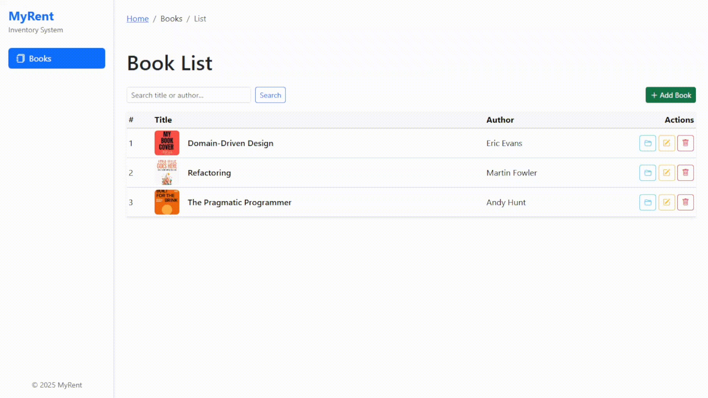

# 📚 Book Rental Management System (PHP Native + Clean Architecture)

A web-based inventory management system specifically for books, built with **pure PHP (no framework)** using the **Clean Architecture pattern** for modularity and scalability.

## 📷 UI Preview



## 🧰 Tech Stack

- PHP 8.1+
- MySQL / MariaDB
- Bootstrap 5 + Bootstrap Icons
- PDO (secure database access)
- Clean Architecture (Entities, Use Cases, Interface Adapters, Framework)
- Component-based pages (Layout, Sidebar, Modal, etc.)

## ⚙️ Installation

### 1. Clone the Repository

```cmd
git clone https://github.com/amrudzr/book-rental.git
```

### 2. Move Project to Web Directory
For Laragon:

Place in `C:/laragon/www/book-rental`

For XAMPP:

Place in `C:/xampp/htdocs/book-rental`

### 3. Create Database
```sql
CREATE DATABASE inventaris_buku CHARACTER SET utf8mb4 COLLATE utf8mb4_unicode_ci;
```

### 4. Configure Connection
Edit: `config/connection.php`

Set your $user, $pass, and $dsn credentials.

## 🛠 Database Setup
Migrations
```cmd
php database/migrate.php
```

Runs all SQL in: `database/migrations/`

Seed Data (Optional)
```cmd
php database/seed.php
```

## ✨ Features
#### ✔️ Complete CRUD operations for books
#### ✔️ Book cover image uploads
#### ✔️ Search functionality (title/author)
#### ✔️ Responsive Bootstrap interface
#### ✔️ Sidebar navigation
#### ✔️ Route handling (index.php?page=...)
#### ✔️ Modal confirmation dialogs
#### ✔️ Organized project structure

## 📂 Project Structure
```
book-rental/
├── public/
│   ├── assets/
│   ├── pages/
│   └── uploads/
├── core/
│   ├── entities/
│   ├── usecases/
│   ├── repositories/
│   └── controllers/
├── config/
├── services/
├── database/
│   ├── migrations/
│   ├── seeders/
│   ├── migrate.php
│   └── seed.php
```

## 🤝 Contributing
- Contributions welcome!
- Fork the repository
- Create your feature branch
- Submit a pull request

## 📜 License
MIT License - see [LICENSE](https://github.com/amrudzr/book-rental/blob/main/LICENSE) for details.

## 👤 Author
Amru Dzaky
#### [GitHub](https://www.github.com/amrudzr) | [LinkedIn](https://www.linkedin.com/in/amru-dzaky-ramadhan/)